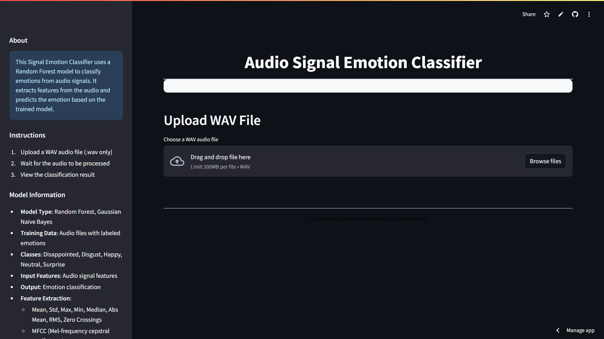

# 🎵 Audio Signal Emotion Classifier 🎧  
**Classify Emotions From Voice Using Machine Learning (Random Forest, SVM, XGBoost, GNB)**



## 🚀 Live Demo  
🔗 [Try it on Streamlit Cloud](https://your-streamlit-link.streamlit.app)

---

## 💡 Overview
This Streamlit web app allows you to **classify emotions from WAV audio files** using machine learning models like:

- 🌳 Random Forest  
- 🔥 XGBoost  
- 💡 Gaussian Naive Bayes  
- 💻 Support Vector Machine (SVM)

Simply upload your `.wav` file and see the magic happen. Complete with emotion predictions, waveform plots, spectrograms, and feature importance charts!

---

## 🔍 Supported Emotions
The classifier is trained on labeled emotion data with the following categories:

- 😞 Disappointed  
- 😖 Disgust  
- 😄 Happy  
- 😐 Neutral  
- 😲 Surprise  

---

## 🧠 Features
✅ Model Selector: Choose from RF, SVM, GNB, or XGB  
⚙️ Parameter Option: Use **Default** or **Tuned** models  
📈 Audio Visualization: Waveform and Spectrogram  
📊 Feature Importance: Only for Random Forest  
🔉 Audio Preview: Listen before predicting  

---

## 📁 How to Run Locally

1. Clone this repository:

   ```bash
   git clone https://github.com/fbrianzy/emotion-classifier-using-audio
   cd emotion-classifier-using-audio
   ```
2. Pip Install Requirements Dependencies
   ```bash
   pip install -r requirements.txt
   ```
3. Run Streamlit Code
   ```bash
   streamlit run main_app.py
   ```
